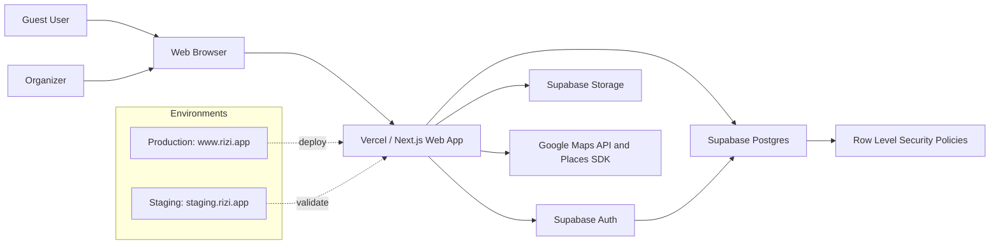
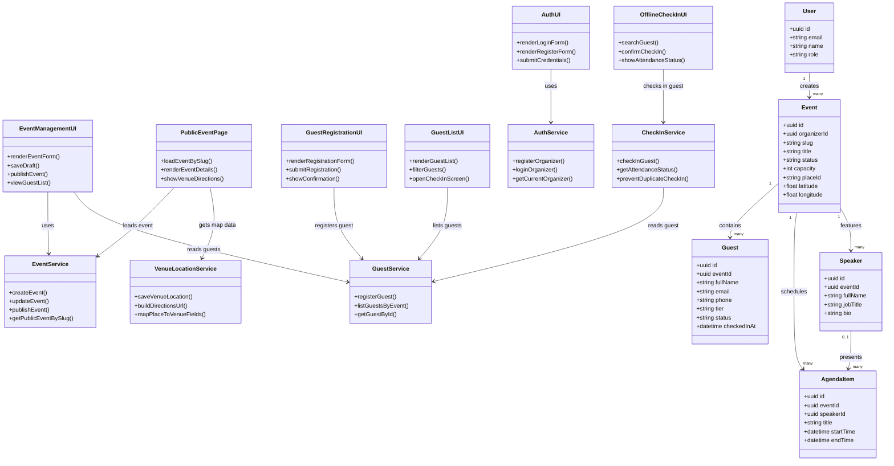
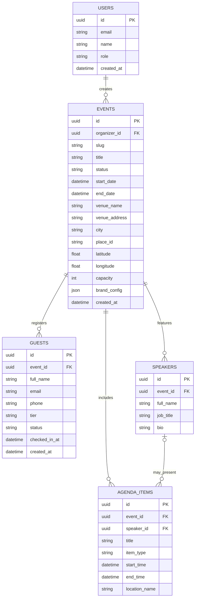
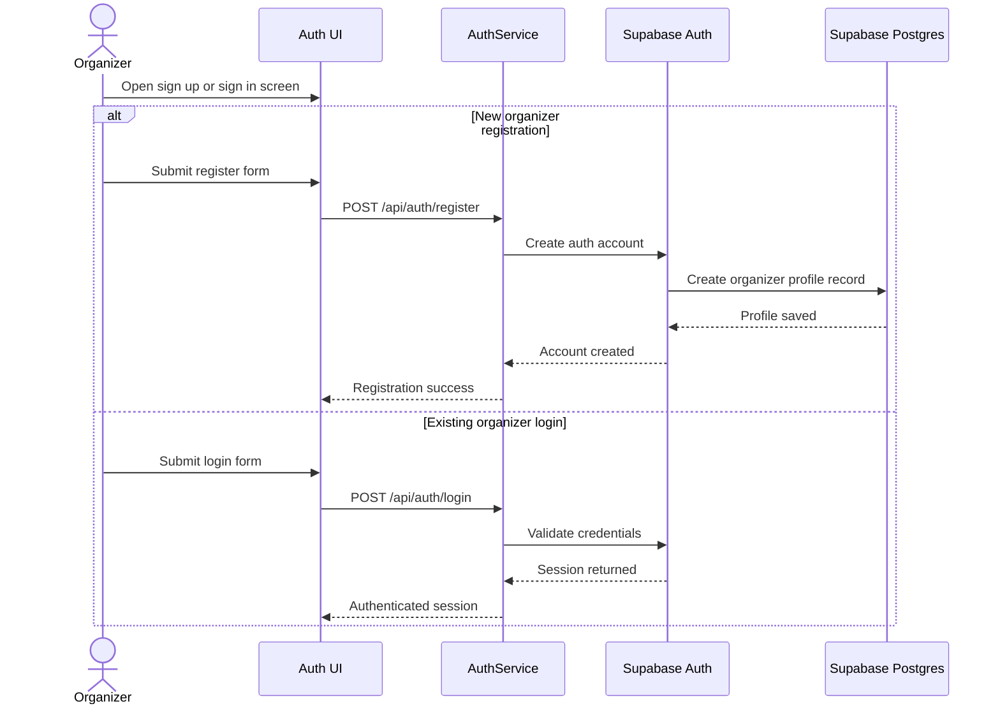
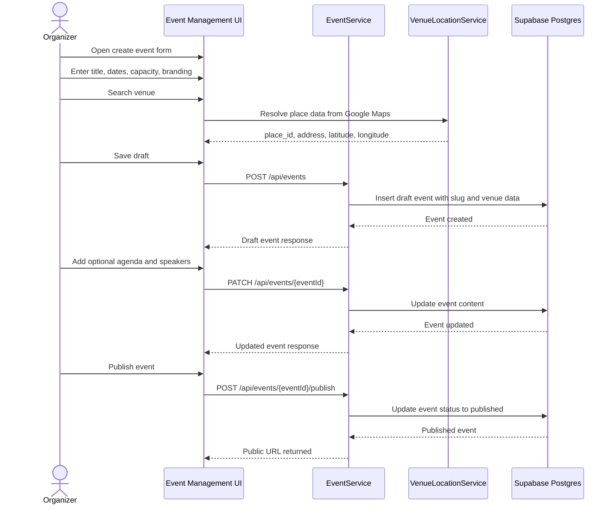
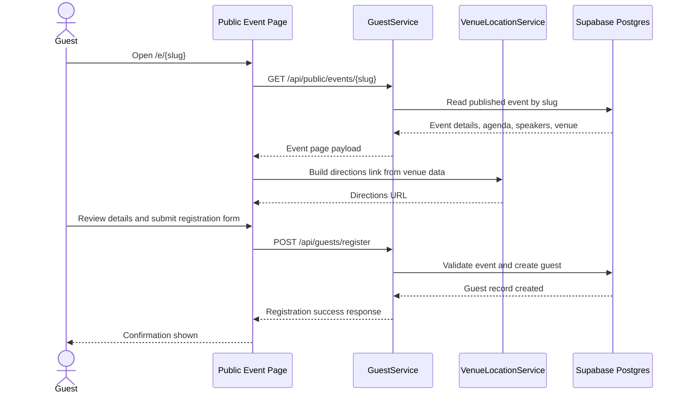
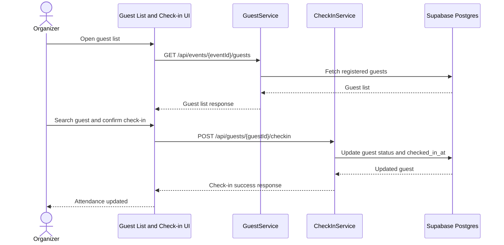

# RiziEvents Diagrams

This page collects every Mermaid diagram used in the project documentation so GitHub can render them in one place.

## Story Coverage Matrix

| User Story | Diagram Coverage |
| --- | --- |
| Organizer creates an account and signs in | Organizer Authentication Sequence, Class Diagram, System Architecture |
| Organizer creates an event with title, date, venue, and capacity | Create and Publish Event Sequence, Class Diagram, ER Diagram |
| Organizer publishes an event to a public URL | Create and Publish Event Sequence, System Architecture |
| Guest opens the public event page | Guest Registration Sequence, System Architecture |
| Guest registers for the event | Guest Registration Sequence, Class Diagram, ER Diagram |
| Organizer sees the registered guest list | Offline Check-in Sequence, Class Diagram |
| Organizer checks in guests manually | Offline Check-in Sequence, Class Diagram |
| Organizer adds agenda items | ER Diagram, Class Diagram |
| Organizer adds speakers | ER Diagram, Class Diagram |
| Guest uses venue directions | System Architecture, Class Diagram |

## System Architecture

## Class and Component Diagram

## Database ER Diagram

## Sequence: Organizer Authentication

## Sequence: Create and Publish Event

## Sequence: Guest Registration

## Sequence: Offline Check-in

