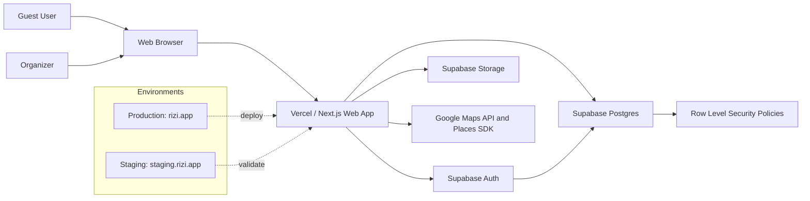
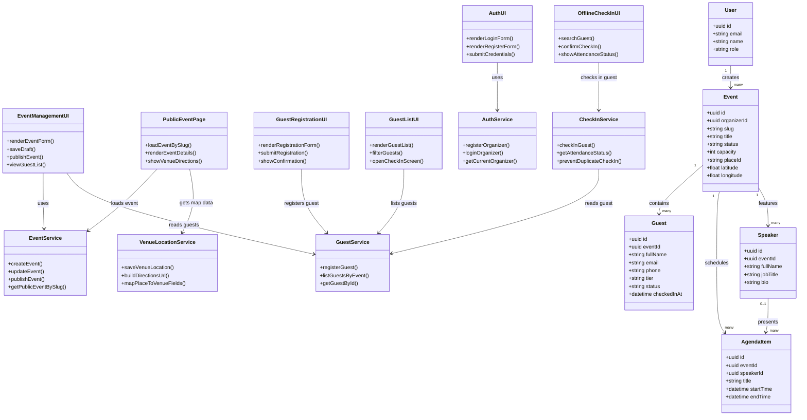
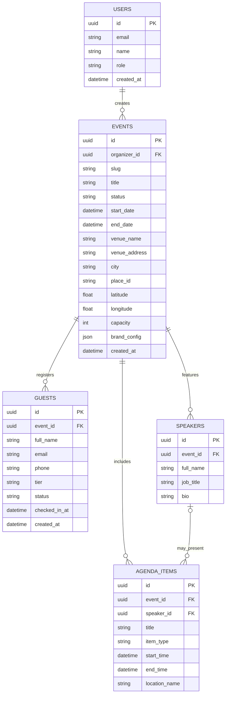
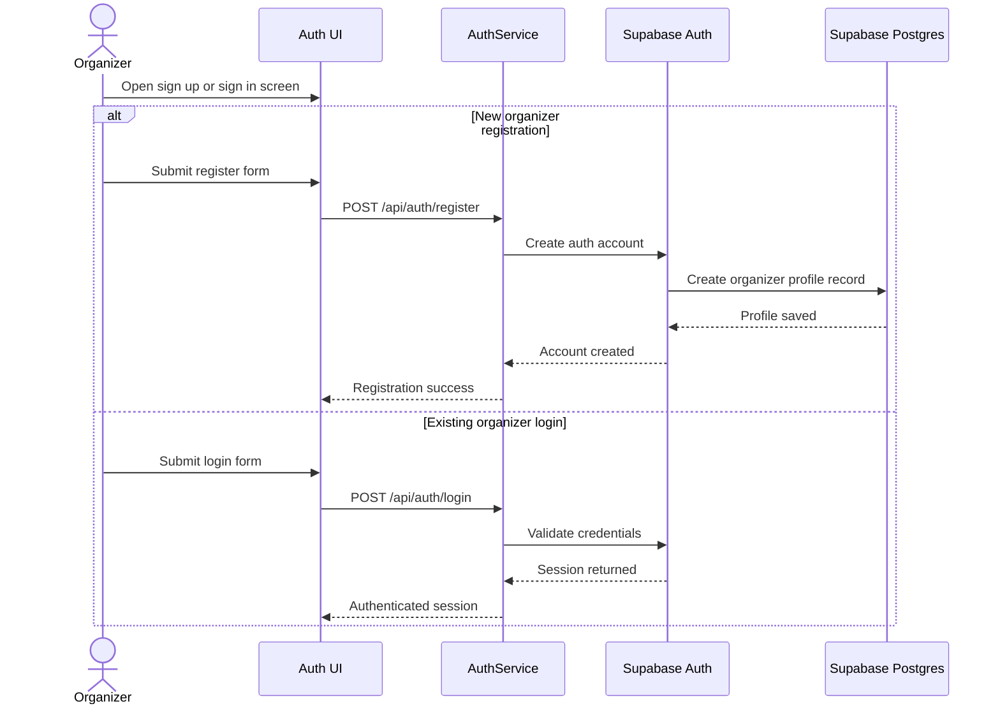
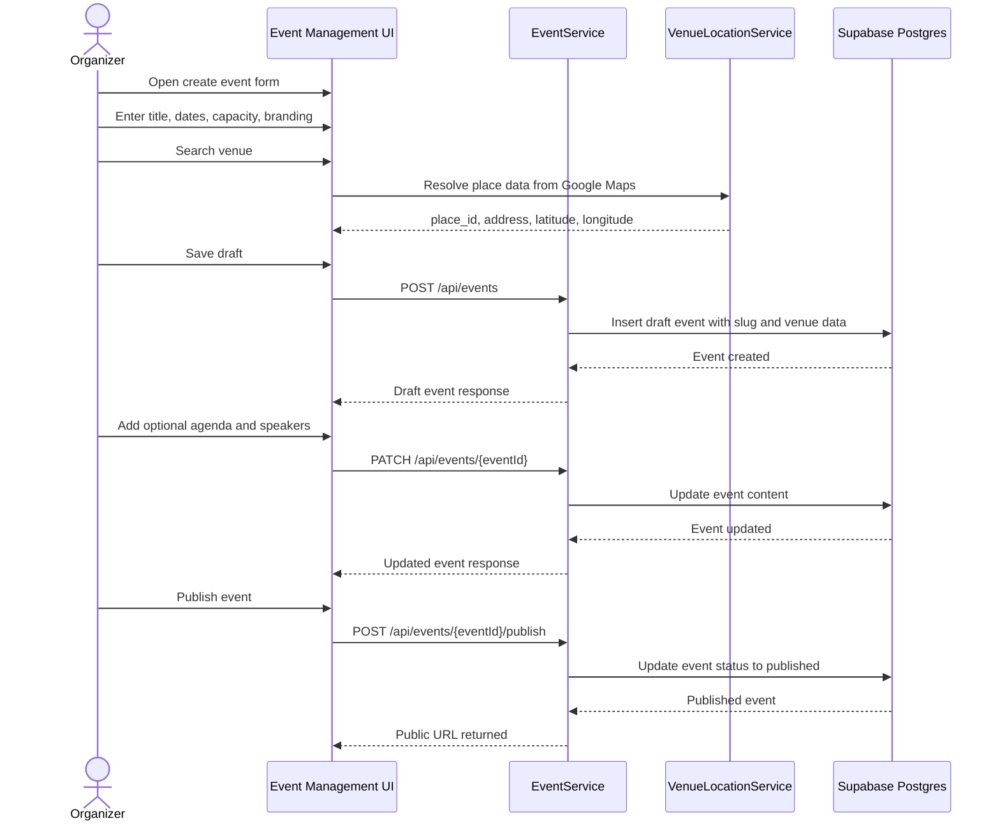
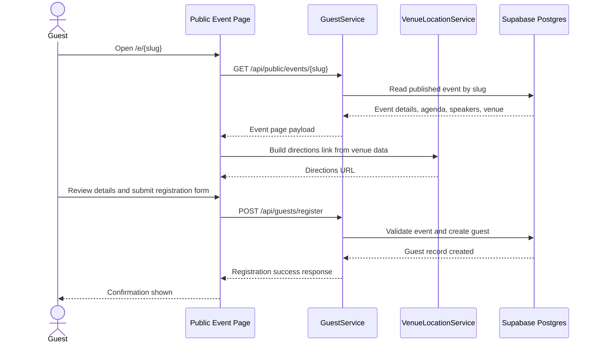
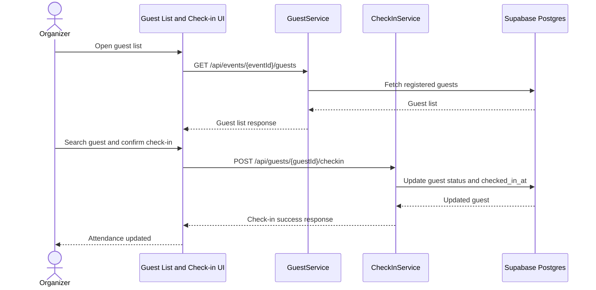

# RiziEvents Technical Documentation

## 1. Project Summary

RiziEvents is a reduced MVP for event publishing and registration. The documented product scope is intentionally limited to the features needed for a phase-three academic review and for a small four-member student team.

The platform allows an organizer to sign in, create an event, publish it under a slug-based public URL, accept guest registrations, and manage offline check-in at the venue. The official MVP architecture uses Next.js on Vercel for the web application and Supabase for authentication, database, and backend platform services.

### Official URLs

- Main application: `https://rizi.app`
- Staging environment: `https://staging.rizi.app`
- Public event page pattern: `https://rizi.app/e/[slug]`

## 2. MVP Scope

### In scope

- Organizer authentication
- Event creation and editing
- Event publishing
- Public event landing page
- Guest registration
- Guest list viewing
- Offline/manual guest check-in
- Venue location selection using Google Maps API and Places SDK

### Out of scope

- Online payment gateways
- Premium subscriptions and monetization
- Custom domains and subdomains
- White-label branding
- Developer API exposure beyond the documented internal endpoints
- Advanced analytics and platform administration features
- Marketplace-style modules
- AI-assisted content generation as an official MVP capability

## 3. User Stories and Priority

### Must Have

- As an organizer, I want to create an account and sign in, so that I can manage my events securely.
- As an organizer, I want to create an event with its title, date, venue, and capacity, so that I can publish it for guests.
- As an organizer, I want to publish an event to a public URL, so that guests can access the event page.
- As a guest, I want to open the public event page, so that I can learn about the event details.
- As a guest, I want to register for the event, so that I can reserve my place.
- As an organizer, I want to see the registered guest list, so that I can manage attendance.
- As an organizer, I want to check in guests manually at the venue, so that I can track who attended.

### Should Have

- As an organizer, I want to add agenda items, so that guests can understand the event schedule.
- As an organizer, I want to add speakers, so that the event page looks complete and informative.
- As a guest, I want venue directions from Google Maps, so that I can reach the location easily.

### Could Have

- As an organizer, I want lightweight brand customization, so that each event page matches the event identity.
- As a guest, I want a clearer registration confirmation experience, so that I know my registration was received.

### Won't Have in This MVP

- As an organizer, I want to accept online payments, so that I can sell tickets online.
- As an organizer, I want to attach a custom domain, so that my event uses a branded URL.
- As a team owner, I want advanced roles, plans, and monetization controls, so that I can manage a commercial platform.

## 4. Mockups

Mockups and user-story drafts were completed earlier by the team and are reused as the visual basis for this submission. The expected main screens covered by those mockups are:

- Organizer sign in and sign up
- Organizer dashboard
- Create/edit event form
- Public event landing page
- Guest registration form
- Guest list
- Offline/manual check-in screen

This repository focuses on the technical documentation and architecture that align with those mockups.

## 5. System Architecture

The high-level architecture is documented in `docs/diagrams/system-architecture.mmd`.
GitHub-rendered diagrams are also collected in `docs/diagrams.md`.

### Architecture overview

- The browser loads the Next.js web application from Vercel.
- Organizer and guest interactions are handled through the web UI.
- The application uses Supabase Auth for organizer sign-in.
- Event, guest, agenda, and speaker data are stored in Supabase Postgres.
- Row Level Security protects organizer-owned data.
- Google Maps API and Places SDK are used for venue search, map display, and directions.
- Production and staging share the same overall architecture but use separate deployment environments.

### Mermaid: System Architecture

## 6. Components and Classes

The class and component relationships are documented in `docs/diagrams/class-diagram.mmd`.

### Frontend modules

- `Auth UI`
  - Handles organizer sign up and sign in.
- `Event Management UI`
  - Handles event creation, editing, publishing, and guest list access.
- `Public Event Page`
  - Displays event details, agenda, speakers, and venue information at `/e/[slug]`.
- `Guest Registration UI`
  - Collects guest details and submits registration requests.
- `Guest List UI`
  - Shows registered guests and their attendance status.
- `Offline Check-in UI`
  - Allows an organizer to mark guests as checked in on-site.

### Backend service classes

- `AuthService`
  - Responsibilities: organizer registration, login, session validation.
  - Key methods: `registerOrganizer()`, `loginOrganizer()`, `getCurrentOrganizer()`.
- `EventService`
  - Responsibilities: create, update, publish, and fetch events.
  - Key methods: `createEvent()`, `updateEvent()`, `publishEvent()`, `getPublicEventBySlug()`.
- `GuestService`
  - Responsibilities: register guests and list guests per event.
  - Key methods: `registerGuest()`, `listGuestsByEvent()`, `getGuestById()`.
- `VenueLocationService`
  - Responsibilities: process venue selection data from Google Maps.
  - Key methods: `saveVenueLocation()`, `buildDirectionsUrl()`.
- `CheckInService`
  - Responsibilities: mark guests as checked in and prevent duplicate check-in actions.
  - Key methods: `checkInGuest()`, `getAttendanceStatus()`.

### Mermaid: Class and Component Diagram

## 7. Database Design

The ER diagram is documented in `docs/diagrams/database-er.mmd`.

### Core tables

- `users`
  - Stores organizer profile data linked to authentication records.
- `events`
  - Stores event metadata, slug, capacity, branding, and venue details.
- `guests`
  - Stores guest registration data and check-in status.
- `agenda_items`
  - Stores schedule entries for an event.
- `speakers`
  - Stores speaker details associated with an event.

### Reduced schema decisions

- Public event routing is slug-based under `/e/[slug]`.
- Payment-related tables are excluded from the MVP design.
- Subscription or premium-plan tables are excluded from the MVP design.
- Venue location data may include `place_id`, `address`, `latitude`, and `longitude`.
- Guests are treated as free-tier participants by default.

### Mermaid: Database ER Diagram

## 8. Sequence Diagrams

The key interaction diagrams are stored in:

- `docs/diagrams/sequence-organizer-auth.mmd`
- `docs/diagrams/sequence-create-publish.mmd`
- `docs/diagrams/sequence-guest-registration.mmd`
- `docs/diagrams/sequence-offline-checkin.mmd`

### Covered scenarios

- Organizer registration and sign in.
- Organizer creates and publishes an event.
- Guest opens the event page and registers.
- Organizer performs offline/manual check-in.

### Sequence coverage note

Together, the sequence diagrams cover the full MVP flow from organizer authentication to event publishing, guest registration, guest list retrieval, and offline check-in. The create/publish and guest-registration sequences also cover the Should Have stories around agenda, speakers, and venue directions at the level expected for this MVP.

### Mermaid: Organizer Authentication

### Mermaid: Create and Publish Event

### Mermaid: Guest Registration

### Mermaid: Offline Check-in

## 9. API Specifications

The detailed endpoint definitions are documented in `docs/api-spec.md`.

### MVP endpoint set

- `POST /api/auth/register`
- `POST /api/auth/login`
- `POST /api/events`
- `GET /api/events`
- `GET /api/events/{eventId}`
- `PATCH /api/events/{eventId}`
- `POST /api/events/{eventId}/publish`
- `GET /api/public/events/{slug}`
- `POST /api/guests/register`
- `GET /api/events/{eventId}/guests`
- `POST /api/guests/{guestId}/checkin`

## 10. SCM and QA

The full plan is documented in `docs/scm-qa-plan.md`.

### SCM summary

- `main` is the protected branch.
- Each task is developed in a short-lived feature branch.
- Pull requests are reviewed before merge.
- Commits stay small and tied to one task or fix.

### QA summary

- Manual smoke tests cover the main organizer and guest flows.
- Targeted component and API tests are added where feasible.
- Staging is used for validation before production release.

## 11. Technical Justifications

The full rationale is documented in `docs/technical-justifications.md`.

### Main decisions

- Supabase reduces backend setup overhead and provides Auth, Postgres, and access control quickly.
- Vercel is a practical fit for Next.js deployment, preview environments, and fast iteration.
- Google Maps is the most useful external integration for accurate venue location and directions.
- Online payments are intentionally deferred to keep the MVP realistic and deliverable for a small student team.

## 12. Acceptance Criteria

- The repository documents only the reduced MVP scope.
- The diagrams match the documented architecture and database design.
- The API specification aligns with the user stories and sequence diagrams.
- The SCM and QA plan is realistic for a four-member student team.
- The `.docx` submission file is generated from the repo content and ready to upload.
